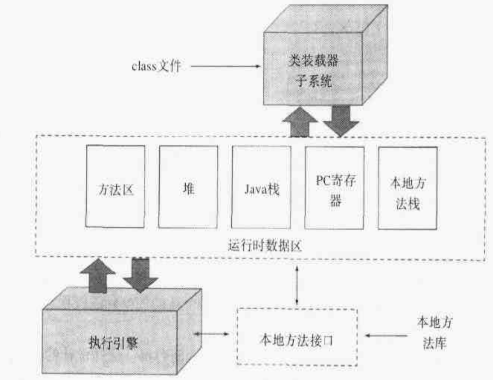

# JVM

## JVM是什么

JVM有三个含义

* JVM的规范
* JVM的具体实现
* JVM的一个运行实例

## JVM的生命周期

JVM实例运行时为应用程序创建非守护线程并运行运行程序，当所有非守护线程都结束时，JVM实例结束运行

## JVM的体系结构

JVM规范通过对一个虚拟机实例的 子系统的行为特征，内存区构成和作用，处理的数据类型和执行的指令 这几方面的抽象描述和它们间的相互作用，来定义一个JVM所应该实现的功能和外部特征

JVM的体系结构包括

* 类加载子系统：负责获取class文件格式的二进制流，处理二进制流并把 类型信息装入到内存的 方法区，并未类型在堆中生成一个Class实例
* 运行时数据区：主要包括 方法区，堆，Java栈，PC寄存器，本地方法栈 等数据块
	* 方法区：存放 加载器装载的类型信息，类型信息包括类名，类字段，类方法，超类，实现的接口，常量池，Class引用，ClassLoader引用，方法字节码等，可以被垃圾回收
	* 堆: 存放程序运行过程中对象，可以被垃圾回收
	* Java栈：每个线程都会有一个私有的Java栈，线程每次条用一个方法都会压一个栈帧，栈帧包含局部变量区，操作数栈，帧数据区 等等
	* PC寄存器：执行引擎执行的下一条指令的地址
	* 本地方法栈：JVM调用本地方法时使用的栈在这里生成
* 执行引擎：执行class文件里的指令，处理数据，一般使用自适应优化技术来优化执行代码
* 本地方法接口：是Java API本地实现 对外暴露的接口

**一个JVM的逻辑结构(图源自《深入Java虚拟机》)**

