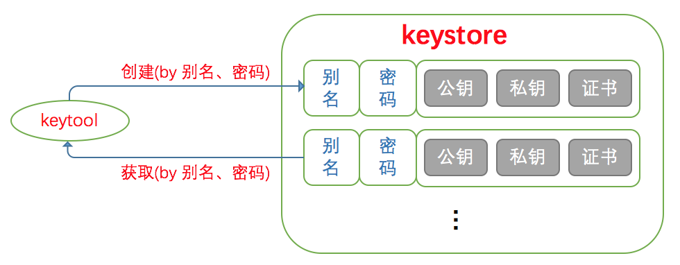
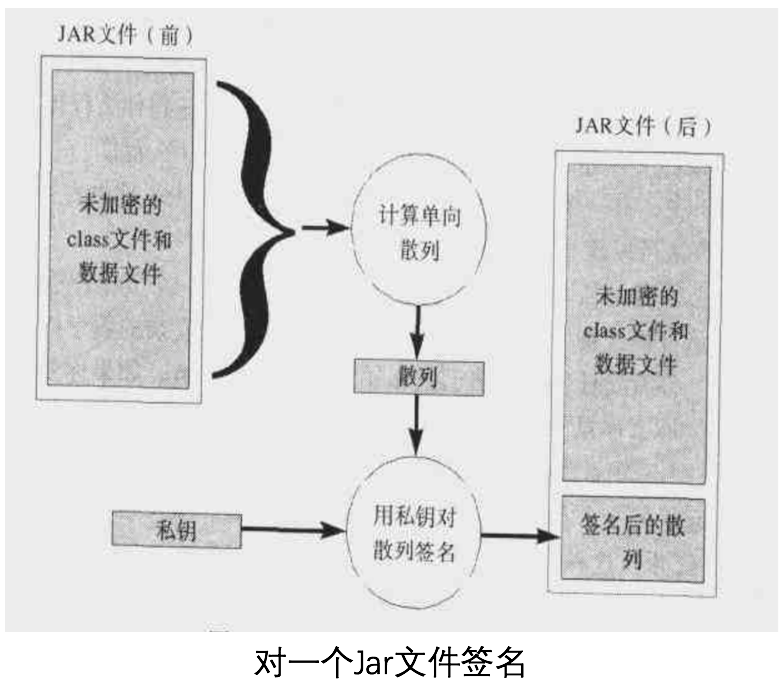
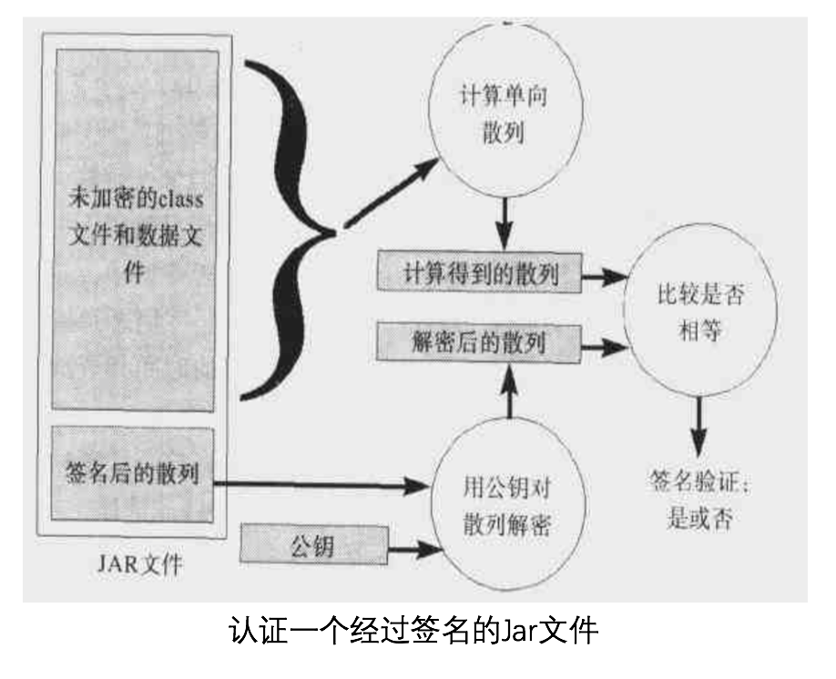

## Java 代码签名和认证

Java对代码进行数字签名和认证需要使用公私钥和证书，对数字签名的原理不熟悉可先阅读这篇简单易懂的[博客](http://www.ruanyifeng.com/blog/2011/08/what_is_a_digital_signature.html "数字签名是什么?")

### Java对 公私钥和证书 的支持

Java提供了内置的工具 keytool 给用户创建 公私钥和证书，用户创建的公私钥和证书是储存在一个 keystore 文件中，keystore文件中可以储存多对公私钥和证书，每对公私钥和证书会与一个 别名 相关联，用户使用 别名 来从keystore文件里获取公私钥和证书



**一个创建公私钥和证书的例子**

```
// 把class文件打包到一个jar文件里
jar cvf example.jar *.class

// 用keytool生成一对公私钥和证书，这些公私钥和证书储存在example_key_store文件，别名是example_alias，获
// 取这对公私钥所用的密码是example_key_pass；创建过程需要填入一些信息，如果example_key_store本来不存在则
// keytool会创建一个并需要你输入example_key_store的密码(可忽略,假设使用密码example_key_store_pass)
keytool -genkey -alias example_alias -keypass example_key_pass -validity 10000 -keystore example_key_store

```

### Java对 使用私钥签名对代码 的支持

Java能对jar包进行签名，所以需要把class文件放到jar包里，并且能对签名后的jar包进行认证





**一个签名的例子**

```
// 用jarsigner对example.jar认证，需要使用别名example_alias从example_key_store里使用密码
// example_key_pass获取私钥
jarsigner -keystore example_key_store -storepass example_key_store_pass -keypass example_key_pass example.jar example_alias

```