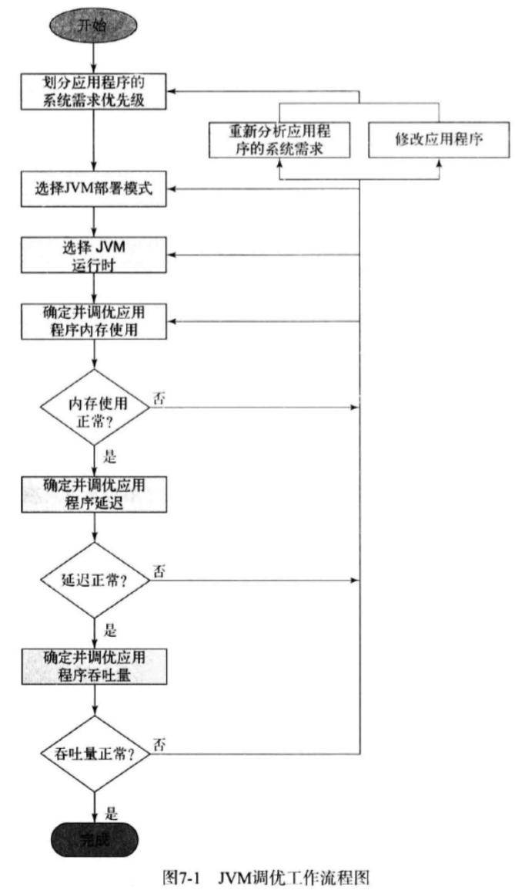

**为什么需要JVM调优？**

JVM上运行的应用多种多样，JVM为了满足应用不同的行为特征和性能需求，提供了很多配置，应用可以按照其特点来配置JVM获得更好的性能

**什么是JVM调优？**

根据应用的行为特征来配置JVM的启动参数，让应用获得其需要的性能  
性能数据一般包括：应用启动时间，内存使用量，吞吐率，延迟

## 应用的系统需求

在进行JVM调优之前，首先要确定应用的系统需求，这个需求应该在设计阶段已经定义好了，系统需求包括：

* 吞吐量：单位时间内应用处理的工作量
* 响应时间：是指不考虑吞吐量的影响，应用接收到指令后开始工作直到完成的时长，
* 内存消耗：同等的吞吐量，响应时间，可用性和可管理性的条件下的内存消耗
* 启动时间：应用初始化所需要的时间
* 可用性：可以理解成健壮性，当系统的某些部分不能工作以后不会影响到系统的其他部分
* 可管理性：对维护，运行，部署系统所产生的开销，可用性的提高很可能会牺牲掉可管理型

## JVM调优的步骤

根据定好的系统需求按照流程来对JVM进行调优，调优时应针对系统运行进入稳定阶段的运行情况来调优，以下是JVM调优的步骤(图源自《Java性能优化权威指南》)：
	

1. JVM调优涉及到多种系统需求，每个需求其实是一个取舍，为了满足某个需求必定为牺牲另外一个需求，所以在调优之前应该清除不同系统需求之间的优先级
2. 接着是根据 可用性，可管理性和内存使用量 来确定JVM部署模式，在单个JVM上部署应用能增加应用的可管理性，但不利于应用的可用性和单个JVM的内存使用量
3. 接着是根据 吞吐量、响应时间、启动时间，内存使用量 来选择JVM运行时，例如Server JVM能更好的满足吞吐量和响应时间，但牺牲了启动时间来进行优化，32位的JVM能提供更快启动时间和更少内存使用量
4. 然后按步骤根据内存使用量、应用的停顿和应用的吞吐量 来对JVM的GC进行调优

由于调优的某个过程会影响到先前的系统需求、或者为了达到某个需求需要调整以前步骤的调优，所以调优的过程是一个重复多次步骤的过程

## JVM GC调优

JVM GC调优主要是面向3个性能属性：  

* 吞吐量: 不考虑停顿时长和内存占用，垃圾收集器能支撑的应用程序的任务量
* 延迟：垃圾收集器导致的应用停顿时长
* 内存占用：垃圾收集器顺畅运行所用的内存

这些属性都是不可兼得的，只能取舍

### JVM监控命令行参数

通过用命令行参数来打印出垃圾回收的一些信息，通过这些信息来监控垃圾回收

获取垃圾收集信息的相关命令：  
-verbose:gc 输出垃圾收集信息  
-XX:+PrintGCDetails 输出GC详细信息  
-XX:+PrintGCTimeStamps 输出时间戳  
-XX:+PrintGCDateStamps 输出日期  
-Xloggc:<filename> 输出到文件  
-XX:+PrintGCApplicationConcurrentTIme 报告application在安全点之间的运行时间  
+XX:+PrintGCApplicationStoppedTime 报告application线程被阻塞的时间  

### 调优GC并确定JVM内存使用量

首先要确定GC所需要的内存使用量，然后作为参考来确定JVM的内存使用量是否合适   
通过获取活跃数据的大小能确定GC所需的内存使用量  
Java堆大小并不代表Java应用程序大小，堆大小只是一部分，还包括调用栈大小，线程开销，io缓存，第三方库分配内存等，若JVM内存使用量超过机器所能分配的内存大小，则需要重新执行以前的步骤来调整需求

活跃数据的大小是应用程序稳定运行时长期存活的对象占用的java堆大小，包括稳定阶段Major GC后的老年代和永久代占用的空间；

首先通过给应用足够的负载来让Java堆进入稳定状态，若出现OOME，则说明最大堆大小设置太小了，增大堆大小来让GC正常运行  
当GC经过多次Major GC后，用工具或命令行来算出多次Major GC后老年代中的占用量和永久代的占用量，这就是老年代和永久代的活跃数据的大小  
获得活跃数据的大小后，一般可以按照3~4倍老年代活跃数据设置老年代，1.2~1.5倍永久代数据设置永久代，1~1.5倍老年代活跃数据设置新生代

经过调整Java堆大小，对JVM内存大小的影响则取决于应用的因素了

### 调优GC延迟

对应用的延迟制定的系统需求主要包括4点：

1. 应用可接受的平均停滞时间
2. 可接受的Minor GC频率
3. 可接受的应用最大停顿
4. 可接受的最大停顿频率

与系统需求相对应的GC延迟包括

* Minor GC的持续时间：对应应用可接受的平均停滞时间
* Minor GC的频率：对应可接受的Minor GC频率
* Major GC的持续时间：对应可接受的应用最大停顿
* Major GC的频率：对应可接受的最大停顿频率

新生代越大Minor GC的平均时长越长而频率越低，老年代越大Full GC的平均时长越长而频率越低；所以通过调整新生代，老年代的大小来调整延迟或频率；

通过调整GC的参数来使上述GC延迟满足系统的延迟需求  
根据Minor GC的持续时间和频率调整新生代的大小，根据Full GC的持续时间和频率调整老年代的大小和决定是否需要切换到新的垃圾收集器

#### 对并行GC的调优

**第一步，调整新生代大小**

根据log里的Minor GC的持续时间、Minor GC的频率来调整新生代(更细粒度的说是Eden)的大小来满足应用可接受的平均停滞时间和可接受的Minor GC频率

**第二部，调整老年代大小**

根据log里的Major GC的持续时间、Major GC的频率来调整老年代的大小来满足可接受的应用最大停顿和可接受的最大停顿频率

在调优老年代大小时，可以根据Full GC的时间戳和持续时间来确定延迟和频率；若log中没有Full GC，则可以通过15次Minor GC以后的Minor GC的记录来推算Full GC中对象的提升率，从而推断出Full GC的频率

调整堆大小时需要符合几个准则：老年代大小至少是活跃数据的1.5倍，新生代至少为堆大小的10%，JVM大小不能超过可用物理内存；

#### 对CMS的调优

**第一步，调整Survivor**

对于CMS，为了减少CMS出现压缩式的Full GC，需要通过更精细的调整Survivor来减少不必要的对象提升到老年代，为此需要通过日志观察新生代中的对象年龄分布，找到合适的Survivor大小来保证年轻的对象都会在Minor GC中被收集

注意，调整Survivor时应尽量保证Eden和老年代的大小不会减少

**第二步，调整老年代**

为了使老年代尽量少发生压缩式Full GC，主要是通过调整触发Major GC的老年代空间占用率 -XX:CMSInitiatingOccupancyFraction，对于占用率的调整主要依据两个因素  
活跃数据的大小：占用率的设置不应小于活跃数据的大小，否则会不停触发Major GC  
老年代对象的提升速率：并发Major GC清理对象的速率不要跟提升速率相差太大，过早的Major GC效率低，过晚的Major GC会引发CMF

通过调整并行remark的线程数来调整最大停顿延迟

可以考虑对永久代开启并发收集来减少产生Full GC的频率

若经过调优后，GC所引起的延迟不能达到预期，能通过两种方法来减少堆内对象的分配率，从而降低延迟

1. 对应用进行性能分析，分析其堆占用，减少对象的分配和保持
2. 改变JVM的部署模式，减少单个JVM的负荷

### 调优GC的吞吐量

调优吞吐量其实就是尽量降低Minor GC和Full GC的频率，例如可以是增大Eden空间降低Minor GC频率，例如增大Survivor空间来让提升发生之前都被Major GC收集了，例如增大老年代来降低Full GC频率等



