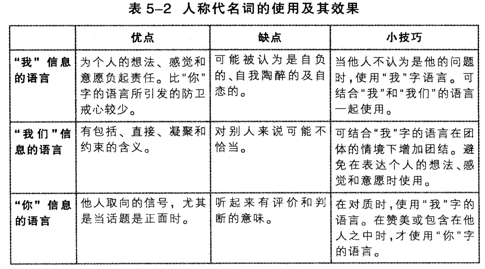

第一章 人际沟通入门

1.1 我们为什么需要沟通  
生理需求：人不能离开其他人  
认同需求：人通过沟通和互动来确定对自己的认知  
社交需求：沟通能有效解决很多社交上的问题  
实际目标：沟通是实现人生中各种目标(生理，安全，社交，工作，人生)的有效手段  

1.2 沟通的历程  
沟通包括哪些步骤或过程，学术上通过使用各种模型来描述  
线性观  
交流观  
沟通的定义：沟通是一种交流的过程，其参与者处于不同但是有所重叠的背景下，经由交换信息而建立关系，关系品质会受到外在的、生理的和心理的噪音所干扰。

1.3 沟通的原则与迷思  

沟通的原则

* 沟通可以是有目的或无目的的行为
* 沟通是不可理转的
* 人不可能不沟通
* 沟通是不可复制的
* 沟通同时具有内容和关系两个向度

沟通的迷思

* 沟通的越多不见得沟通的越好，例如负面沟通越多越不好
* 意思不在字眼里，例如沟通不一定就是要把话说出来
* 成功的沟通并不表示彼此了解
* 人的反应并非针对单一事件或特定的对象
* 沟通不会解决所有问题

1.4 人际沟通的本质

第二章 认同：自我的塑造和展现

2.1 沟通和自我概念

自我概念：对自己持有的相当稳定可靠的直觉，包括身体特征、状态、情感等  
自尊是自我概念的一部分，是对自我价值的评估  
高自尊会对沟通有较正向的预期，这些预期增加沟通的成功率，因此对正面预期会强化沟通，低自尊反之  
生物性决定了一个人的性格，而性格会对自我概念产生重大影响，也会对沟通产生重要影响  
社会中对个人的评价也是影响自我概念的重要因素

自我概念的特点  

* 自我概念是主观的，有可能不能客观的反应真实的状态：以往的经历、他人错误的回应、过于期待完美 都会影响自我评价，自尊的高低会对沟通行为产生正向和反向的影响
* 自我概念会抗拒改变，更倾向接受符合现存自我概念的信息，抗拒修正不正确的自我概念

文化，性别都会影响自我概念的塑造  

自我应验预言会影响自我概念从而沟通  
自我应验预言的步骤：期待某事某结果，表现出与期望一致的行为，某事发生，强化期待  
自我应验预言包括自我强加语言和别人强加语言，分别对应着自己期待某事和别人期待

改变自我概念的一些方法：  

* 拥有真实的自我感：罗列出自己的优缺点，不要过于苛刻，可以找别人帮忙确认
* 拥有切合实际的期待：不要对沟通表现期待过高，要符合现有的沟通能力
* 拥有改变的意愿：要切实的行动去改变
* 拥有改变的技巧：通过阅读和其他人的指导学习技巧，通过仔细观察别人来取长补短

2.2 自我的展现：沟通作为认同管理

自我有隐私的自我和公开的自我

认同管理是用来影响别人对自己观感的策略性沟通，特征包括：

* 人致力于构建多元认同，就是让别人对自己有不同方面的好印象，例如幽默、稳重等等
* 认同管理是一个双向的过程，双方都会进行着认同管理
* 认同管理可以深谋远虑或不知不觉
* 认同管理会因为情境不同而不同，通过自我管理来达到认同认同管理的目的
* 自我管理的程度因人不同，高度自我管理的人在沟通中能更好的进行认同管理

为什么需要认同管理：

* 开始经营关系
* 获得别人的顺从
* 保证别人的颜面

如何进行认同管理：

* 面对面印象管理：举止、外貌和物品；举止包括语言和非语言，外貌包括着装、打扮等，物品包括车、表等
* 非面对面：通过文字表达等

第三章 知觉：看到什么就是什么

3.1 知觉历程

* 选择：选择引起注意的主题，例如强烈的刺激，重复的刺激，个人动机
* 组织：根据自己的经验和想法来理解别人和沟通
	* 过程中存在的问题有偏见，断句；解决方法去除偏见、认出双发不同观点考虑有益的方法
* 诠释：理解话中的特定意义
* 协商：互相交流，包括意见相阻或共同理解达成一致

3.2 影响知觉的因素

* 生理因素
* 文化差异
* 社会角色
* 自我概念

3.3 知觉的倾向

除了影响知觉的因素以外，人在诠释他人的行为还会有倾向

* 对人严厉，对己仁慈
* 强调别人的缺点
* 最明显的最有力，问题在于最重要的因素不一定最明显
* 先入为主
* 以己之心度人之腹

*3.4 知觉检验*

知觉检验是一种帮助理解别人的好方法，完整的程序包括3部分：描述你注意到的行为，列出来关于此行为至少两种可能的诠释，请求对方对行为诠释作澄清

**知觉检验的考量**

* 完整性：某些情况下，知觉检验不许囊括所有程序
* 非口语的一致性：你的表情语调应该是真诚的，开放的
* 文化支配：在高语境敏感文化(亚拉)里会把知觉检验这种直白的方式视为潜在的窘境，需要用间接的方式来了解暧昧信息
* 保留颜面：知觉检验的多种诠释有时能保留别人的脸面

3.5 同理心与沟通

知觉检验能澄清暧昧的信息，但不一定能了解背后的原因，需要设身处地

*同理心*是从某人的角度来体验世界，重新创造个人观点的能力

同理心有三个面向：

* 同理心包含获得知觉，一种采用别人观点的尝试，这需要中止你的论断，将自己的意见放在一边，同时试着去了解对方
* 同理心的情感面向，使我们更贴近的去体验别人的感受
* 同理心第三面向是真诚的关心对方的福祉

有同理心不一定需要同意别人的观点，也不可能完全同理

*帮助建立同理心的方法：*

枕头法：站在“我对你错”、“你对我错”、“双方都对，双方都错”、“议题不重要”、“四个立场都具有真理”  
这个方法让人全面的考虑到所有立场的有点，并发现真正重要的东西，并且在最终确定立场的时候可以不影响到更重要的东西

第四章 情绪：适时适地的产达感觉

4.1 情绪是什么？

情绪通常包括几个因素

* 生理因素：血压、心跳等
* 非口语因素：表情，手势等
* 认知的解释：对认知的不同解释体现不同的情绪会影响
* 口语表达：不同的口语表达代表不同的情绪强度

4.2 影响情绪表达的因素

* 性格：外向内向
* 文化：集体主义和个人主义
* 性别：男女
* 社会习俗：
* 自我坦露的不安：
* 情绪感染力：情绪是能传染的

4.3 情绪表达的原则

一些帮助决定何时和如何表达情绪的建议：

* 辨认感觉：尝试辨认自己的情绪，能有助于自已意识到自己会不合理发泄情绪
* 辨识感觉，说话和行动之间的不同：了解感觉和发泄情绪之间的差异有助于在失序的情景中建设性的表达自己
* 以口语阐明情绪：想表达情绪是要用能清除表达情绪的词汇，而婉转表达可能会让别人不理解你的情绪
* 分享多样的情绪：人总是只会表达出最负面的情绪而不是全盘的情绪，否则对方反应会不一样
* 评估何时与何处表达情绪：一阵强烈的情绪涌上的瞬间并不是说出口的最佳时机；处理情绪需要花很多时间和精力，应该要专心的进行处理，并保证对方也一样；有些时候最后还是不要表达情绪
* 对自己的情绪负责：你。。。我觉得。。。
* 选择合适的渠道

4.4 管理困扰的情绪

有助益情绪有利于沟通，而无助益情绪怎会影响沟通，它们之间的区别是一种情绪的强度和持续性  
无助益的情绪对于 缓解难受 和 增进关系 都没好处

无助益情绪的来源：

* 生理因素
* 情绪记忆
* 自我内言：事件 认知 感觉
* 非理性的认知导致不良的自我内言
	* 完美主义，甚至弄虚作假伤害自尊
	* 过于追求别人的认同，甚至放弃自己的原则和需求
	* 理所当然，把一切不合意的事情看得理所当然，可以不合意但应该付诸行动而不应该觉得理所当然
	* 过度推论：夸大缺点，过于聚焦处理结果的不足而忽视了问题的复杂性
	* 因果论的谬误：认为情绪是由他人引起的而非一个人的非理性的自我内言
	* 无助的谬误：麻木的认为“不能”，其实是不愿意改变
	* 灾难性预期的谬误：
	
减少无助益情绪的方法：

* 监控你的情绪反应
* 注意情绪是由什么事件引起的：这些事件有时不是那么显而易见，或不是单一事件引起的
* 记录你的自我内言：这是一个一开始困难需要不停锻炼的
* 驳斥你的非理性观念

第五章 语言：既是障碍又是桥梁

5.1 语言是符号

语言只是符号，但每个人对不同的符号有不同的理解

5.2 语言的影响

* 命名与认同：大家对名字有一些共同的理解
* 联盟关系：大家趋向使用相同的交流方式来构建关系，而用俚语来与其他人区分
* 权力：用低权力的语言避免损害人际关系，但用权威性的语言可能会最快的达到效果
* *打岔性语言：一些语言上的不良会增加冲突*
	* 事实与意见的混淆：事实是无可争辩的，意见则是主观的，当表达意见时把它当事实来表达会引发不必要的争论，可以加上“我觉得”，“在我看来”不会减少敌对性
	* 事实与推论的混淆：推论性陈述是指在一切都没定的情况下就做出结论，当我们当推论作为事实是会引起争议
	* 情绪性的语言：情绪性语言表面上在陈述事实，但实际上表明了说话着的态度和意见，更容易引发争议，可以用中性字眼来更精确的表达，也更容易被接受
* 语言的责任性：
	* “这...”有托词的意味，而“我”则为表达的感觉负责
	* “但是”是一种保留颜面的策略，要清楚的表达是最好不要用
	* “疑问句”一些是请求，而一些是避免成为我的宣告的语言手段
	* “我”和“你”，使用“你”的时候很容易表达出对别人下诊断，会激起别人的戒心，也会造成地位不对等的错觉，一般不会意见；使用“我”提供比较精确，不那么挑拨的方式来表达不满，表明说话者愿意为不满负责，“我”陈述一般包含四部分：他人的行为，你的诠释，你的感受，他人行为对你的后续影响；但即使在用“我”表达时，你的情绪，手势等非语言全都在表达出“你”时，也会成为“你”的效果；但即使使用“我”来表达不满也不见的好，因为没有人喜欢自己不对，并且“我”还会被认为以自我为中心，所以最好节制使用“我”
	* “我们”	：使用“我们”时含有表达的议题是双方共同关心并负责的
	

5.3 性别与语言

构成男女沟通差异的一些因素

* 内容
* 沟通的理由
* 对话的形式
* 非性别因素

5.4 语言与文化

* 口语沟通的形式

