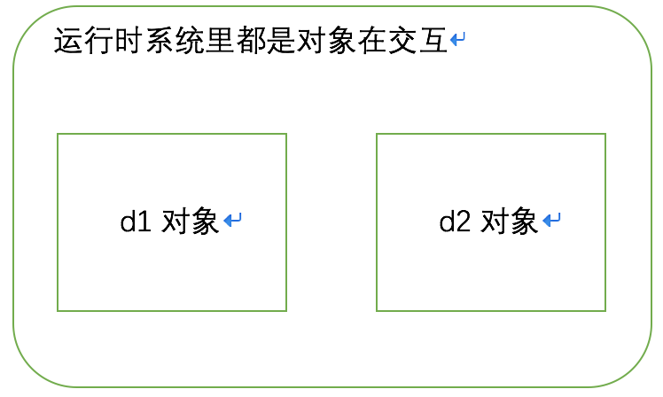

# 面向对象系统的基本知识

对象是在面向对象系统里的基本元素，通过各个对象之间的交互（互相发送请求消息）来实现面向系统的功能

## 面向对象的基本术语

**方法** 是一个操作或一个请求，包含名字，参数和返回值
	
**接口** 是一系列方法的集合，对象可以拥有接口，所以接口体现了一个对象所能完成的功能

**类型** 是一个接口的名字，可以理解为等同于接口，类型可以有子类型和父类性，当一个类型包含另一个类型的时即为子类型

**类** 定义一个对象，提供（多个）类型里方法的实现，这是对象的一个静态写照

**对象** 面向对象系统里运行时的基本元素，对象之间可以相互交互，对象是一个类的实例化，可以拥有多个类型

例如：

	interfaced Duck { // 类型
		void quark() // 方法
	}

	class ConcreteDuck implements Duck { // 类，定义了Duck类型的实现
		static void quark() {
			// real quark
		}
		
		public static void main(String[] args) {1l
			Duck d1 = new ConcreteDuck();
			Duck d2 = new ConcreteDuck();
			
			d1.quark();
			d1.quark();
		}
	}

## 面向对象系统的核心概念

**封装** 把数据和对数据的操作聚合起来形成一个对象

例如:

	class Duck { // 把name和quark封装成一个对象
		String name;
		
		void quark() {
			System.out.println(name + " quarking...");
		}
	}
	
**继承** 包括两个含义

* 类型继承：定义子类型，实现不同类型的替换
* 实现继承：实现代码的复用和实现的方法重定义

类型继承举例:
	
	interface Quarkable {
		void quark()
	}
	
	interface Duck extends { // 类型继承
	}
	
	class ConcreteQuarkable implements Quarkable {}
	
	class ConcreteDucke implements Quarkable {}
	
	class Demo {
		static void runDemo(Quarkable q) {
			q.quark()
		}
		
		public static void main(String[] args) {1l
			runDemo(new ConcreteQuarkable());
			runDemo(new ConcreteDucke());
		}
	}
	
实现继承举例:
	
	class ConcreteQuarkable {
		void quark() { }
	}
	
	class ConcreteDucke1 extends ConcreteQuarkable { } // 继承了quark的实现

	class ConcreteDucke2 extends ConcreteQuarkable {
		void quark() { }  // 重定义了quark的实现
	}

**多态** 在运行时动态的替换拥有相同类型的对象，如上类型继承举例

## 代码和功能的复用机制

**继承** 可以实现代码的复用，缺点：这是在编译时实现的代码复用，所以是一种相对运行时来说的静态复用，不够灵活;子类会破坏父类的封装性，并对父类的代码产生依赖；优点是简单粗暴

举例：

	class HashSet {
		...
		void addAll(Collection c) {
			for(Object o : i)
				add(o);
		}
		
		void add(Object o) {
			...
		}
		...
	}
	
	class BraokenSubSet { // broken cause dependency
		int counter = 0;

		@Override void add(Object o) { couter++; super.add(o); }
		
		@Override void addAll(Collection c) { couter += c.size(); super.addAll(c); }
	}

**组合** 可以实现运行时的对象功能复用，通过多态能更加灵活; 缺点是会增加对象的数量导致增加运行时的复杂性

举例：

	interfaced Duck {
		void quark()
	}

	class Demo {
		Duck d；
		
		Demo(Duck d) { this.d = d; }
		
		void setDuck(Duck d) { this.d = d; }
		
		void quark() { d.quark(); }
		
		public static void main(String[] args) {
			Demo demo = new Demo(new Duck(){
				void quark() {
					// implement version 1
				}
			});
			demo.quark();
			
			demo.setDuck((new Duck(){
				void quark() {
					// implement version 2
				}
			});
			demo.quark();
		}
	}

**委托** 通过组合来复用代码的功能，但又不需要继承

例如:

	interface Duck { void quark(); }
	
	class ConcreteDucke1 extends Duck { 
		void quark() { }
	}

	class ConcreteDucke2 extends ConcreteQuarkable {
		ConcreteDucke1 d;
		
		ConcreteDucke2(ConcreteDucke1 d) { this.d = d; }
		
		void quark() { d.quark(); }
	}

**参数化类型** 把类型作为一种可变的参数，是的代码不依赖于类型

例如：List，Set，Map等

## 面向对象设计的原则

前提：视情况有取舍地使用这些原则，没有死规定

**封装变化** 把可变的部分封装成对象

例如：父类的两方法的实现在子类中存在着变化和重复时，应该单独封装

	// Bad example
	class Duck {
		void fly() { System.out.println("Fly"); }
		void quark() { System.out.println("quark"); }
	}
	
	class ToyDuck extends Duck {
		@Override void fly() {}
		@Override void quark() { System.out.println("toy quark"); }
	}
	
	class WildDuck extends Duck {
		@Override void fly() { System.out.println("Fly Height"); }
		@Override void quark() { System.out.println("quark loudly"); }
	}
	
	class CannotFlyWildDuck extends Duck {
		@Override void fly() {} // 重复的代码
		@Override void quark() { System.out.println("quark loudly"); } // 重复的代码
	}
	
	// Good Example
	interface Quarkable { void quark(); }
	
	class Normal implements Quarkable { void quark() { System.out.println("quark"); } }
	class Silece implements Quarkable { void quark() {} }
	class Loud implements Quarkable { void quark() { System.out.println("quark loudly"); } }
	class ToySound implements Quarkable { void quark() { System.out.println("toy quark"); } }
	
	abstract Duck {
		Quarkable q;
		Duck() { this.q = new Normal(); }
		void quark() { q.quark(); }
		
		void fly();
	}
	
	class Duck extends Duck {
		void fly() { System.out.println("Fly"); }
	}
	
	class CannotFlyWildDuck extends Duck {
		@Override void fly() {}
	}
	
	class ToyDuck extends CannotFlyWildDuck {
		ToyDuck() { this.q = new ToySound(); }
	}
	
	class WildDuck extends Duck {
		WildDuck() { this.q = new Loud(); }
		@Override void fly() { System.out.println("Fly Height"); }
	}

**针对接口编程而非针对实现编程** 包括2个方面：

* 客户代码使用接口编程能获得动态替换具体实现的灵活性
* 接口的实现部分可以获得独立性和扩展性

**多用组合，少用继承** 对父类实现的依赖导致父类的修改影响到子类

**为了交互对象之间的松耦合设计而努力** 松耦合是指交互的对象之间不知道彼此的实现细节，只知道彼此拥有的接口，所以对象的具体实现的改变能互不影响

**开放--关闭原则** 已有代码应该对扩展开放，对修改关闭；集中精力实现最后可能改变的地方即可

**依赖倒置原则** 要依赖抽象的类型，不要依赖具体实现的类；编码时就是高层组件不要依赖底层组件

**最少只是原则** 尽量减少对象间的相互依赖，否则动一发而动全身；要遵守这个原则就应该之访问以下范围内的对象的方法：

* 该对象本身
* 作为参数传进来的对象
* 此方法所创建的对象
* 对象的组件

**好莱坞原则：别调用我们，我们调用你** 高层组件决定怎样使用提供给底层组件的钩子

**单一责任原则** 一个类应该只有一个引起变化的原因

